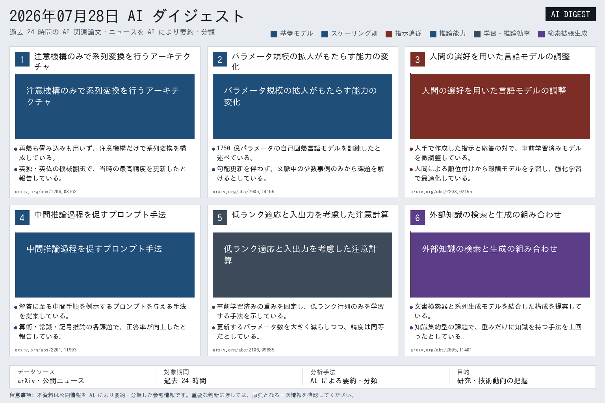
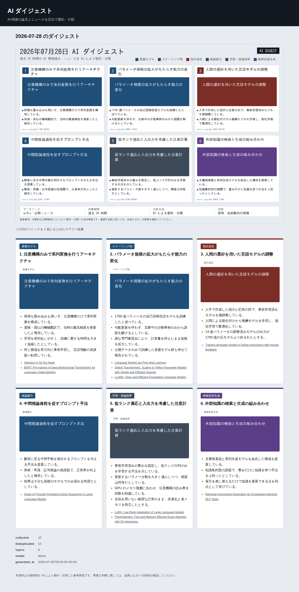
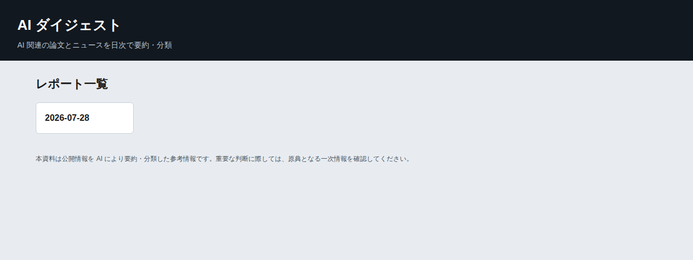

# ai-digest

## Overview

**ai-digest** collects AI related papers and news once a day, summarizes and classifies them in Japanese with the Claude API, and publishes the result as a browsable HTML report together with a single composite PNG image.

The batch pipeline and the web viewer are separate processes. `cli.py` performs the daily collection and generation, writes everything under `data/reports/<date>/`, and exits. `app.py` is a read only Flask application that serves what the batch already produced, so a failed or slow run never takes the site down and the web process needs no API key.

Every topic carries an illustration. The application first tries to obtain a real image from the source, an `ar5iv` figure for arXiv papers or the Open Graph image for news articles, and draws a card locally with Pillow when that fails. Scraping is best effort by design; a publisher changing its markup degrades the look of the report, never its availability.

The Claude API is only used for one stage: clustering, translating and classifying the collected entries into topics. Collection (arXiv, RSS/Atom) and every image path already run without an API key. Setting `SUMMARIZER_BACKEND=plain` removes the last dependency and runs the whole pipeline offline except for fetching the feeds themselves; see [Standalone use, no API key](#standalone-use-no-api-key).

## Features

- **Daily pipeline in a single command**: collect, deduplicate, summarize, illustrate, render
- **Structured summarization**: the Claude API is called through tool use, so the answer is validated JSON rather than prose
- **Japanese output**: English sources are translated and condensed into two to four bullet points per topic
- **Free form categories**: labels are chosen by the model per day, and colors are derived from the label so that they stay consistent within a report
- **Resilient image handling**: scraping is attempted first and falls back to locally generated cards
- **One image per day**: a composite PNG summarizing the whole report, drawn with Pillow, without a headless browser
- **No database**: reports are plain JSON and PNG files under one directory per day
- **Deployable as is**: `gunicorn` and a `Procfile` for Heroku, `systemd` and `cron` for a VPS

## Requirements

- Python 3.9 or later
- An Anthropic API key with access to the Claude Messages API, unless `SUMMARIZER_BACKEND=plain` (see [Standalone use, no API key](#standalone-use-no-api-key))
- A CJK capable TrueType font, for example the `fonts-noto-cjk` package; see [Japanese font](#japanese-font)
- Outbound HTTPS access to `export.arxiv.org`, the configured feeds and, unless running standalone, the Anthropic API

Python dependencies are listed in `requirements.txt`:

| Package | Purpose |
|---|---|
| Flask | Web viewer and Jinja2 templates |
| anthropic | Claude API client |
| feedparser | arXiv Atom and news RSS parsing |
| requests | HTTP transport for the collectors and the scraper |
| beautifulsoup4 | HTML parsing for figure and Open Graph extraction |
| Pillow | Fallback cards and the composite summary image |
| python-dotenv | Loading of the local `.env` file |
| gunicorn | Application server used in production |

## Installation

The following steps assume Debian or Ubuntu. Adjust the package manager commands for other systems.

### 1. Install the system packages

```sh
sudo apt update
sudo apt install python3 python3-venv python3-pip fonts-noto-cjk
```

`fonts-noto-cjk` is not optional in practice. Every string drawn into an image is Japanese, and neither the bitmap font bundled with Pillow nor DejaVuSans contains CJK glyphs, so without it the generated cards and the summary image show empty boxes instead of text.

### 2. Clone the repository

```sh
git clone https://github.com/id774/ai-digest.git
cd ai-digest
```

### 3. Create a virtual environment and install the dependencies

```sh
python3 -m venv .venv
. .venv/bin/activate
pip install --upgrade pip
pip install -r requirements.txt
```

### 4. Configure the environment

```sh
cp .env.example .env
$EDITOR .env
```

At minimum, set `ANTHROPIC_API_KEY`. An Anthropic-compatible API can instead use
`ANTHROPIC_AUTH_TOKEN`. The `.env` file is ignored by Git and must never be committed.
Exported variables take precedence over `.env` values.

### 5. Verify the installation

```sh
python cli.py --version
python cli.py list
python -m unittest discover -s tests
```

The first command prints the version, the second prints nothing on a fresh installation because no report exists yet. The third runs the test suite, which needs no network access, no API key and nothing beyond the standard library and the installed dependencies.

## Configuration

All settings are read from environment variables, optionally through `.env`. They are collected in `config.py`.

| Variable | Default | Description |
|---|---|---|
| `ANTHROPIC_API_KEY` | none | Claude API key. Mutually exclusive with `ANTHROPIC_AUTH_TOKEN`. |
| `ANTHROPIC_AUTH_TOKEN` | none | Bearer token for an Anthropic-compatible API. |
| `ANTHROPIC_BASE_URL` | none | Base URL for an Anthropic-compatible API. |
| `ANTHROPIC_MODEL` | `claude-sonnet-4-5` | Model used for summarization. |
| `ANTHROPIC_THINKING_MODE` | `default` | `default` sends no thinking parameter and keeps the provider default. `disabled` sends `thinking.type=disabled`, for a model that would otherwise think until the output budget is gone. |
| `ANTHROPIC_TOOL_CHOICE_MODE` | `forced` | `forced` names `build_report` in `tool_choice`. `auto` lets the model choose the tool and disables parallel tool use. |
| `SUMMARIZER_BACKEND` | `claude` | `claude` calls the Claude API. `plain` builds topics mechanically, with no API key and no clustering or translation; see [Standalone use, no API key](#standalone-use-no-api-key). Any other value stops `cli.py run` before it collects anything, rather than falling back on `claude`. |
| `ARXIV_CATEGORIES` | `cs.AI,cs.LG,cs.CL` | arXiv categories to collect, comma separated. |
| `ARXIV_MAX_RESULTS` | `60` | Maximum entries fetched per category. |
| `NEWS_FEED_URLS` | three AI blogs | RSS or Atom feeds to collect, comma separated. |
| `LOOKBACK_HOURS` | `24` | Age limit of the collected entries. |
| `MAX_TOPICS` | `6` | Maximum topics per report. Six fills the summary image grid. |
| `AI_DIGEST_FONT_PATH` | probed | Path of the font used for image generation. |
| `DATA_DIR` | `data/reports` | Directory holding the generated reports. |
| `HTTP_TIMEOUT` | `15` | Timeout in seconds of every outgoing HTTP request. |
| `USER_AGENT` | `ai-digest/1.0 ...` | User-Agent sent with every outgoing request. |
| `PORT` | `5000` | Port of the development server and of gunicorn. |

### Anthropic-compatible APIs

Set a base URL and Bearer token to use an Anthropic-compatible Messages API.
For example, Sakura AI Engine can be configured as follows:

```env
ANTHROPIC_API_KEY=
ANTHROPIC_AUTH_TOKEN=<UUID>:<secret>
ANTHROPIC_BASE_URL=https://api.ai.sakura.ad.jp
ANTHROPIC_MODEL=preview/Kimi-K2.6
ANTHROPIC_THINKING_MODE=disabled
ANTHROPIC_TOOL_CHOICE_MODE=auto
SUMMARIZER_BACKEND=claude
```

Do not set `ANTHROPIC_API_KEY` and `ANTHROPIC_AUTH_TOKEN` together.
The provider must support `tools` and `tool_use` responses.

Being compatible with the Messages API does not mean behaving like Anthropic.
Support for a named `tool_choice` and for the thinking output varies from one
model to the next, which is what the two settings above are for. When a run
fails and the log shows `stop_reason=max_tokens` together with
`content_types=thinking`, the model used the whole output budget thinking and
never reached the tool call. Set `ANTHROPIC_THINKING_MODE=disabled` before
raising the `MAX_OUTPUT_TOKENS` constant of the summarizer: more budget only
buys more thinking, it does not buy a tool call.

### Japanese font

`AI_DIGEST_FONT_PATH` overrides the font used by the image generators. When it is empty, these locations are probed in order and the first existing file wins:

```
/usr/share/fonts/opentype/noto/NotoSansCJK-Regular.ttc
/usr/share/fonts/opentype/noto/NotoSansCJKjp-Regular.otf
/usr/share/fonts/truetype/fonts-japanese-gothic.ttf
/usr/share/fonts/truetype/vlgothic/VL-Gothic-Regular.ttf
```

When no CJK font is found, the batch logs a warning once and keeps running with the Pillow bitmap font; the HTML report stays correct, but the images lose their text.

## Standalone use, no API key

Set `SUMMARIZER_BACKEND=plain` to run the whole pipeline without an Anthropic API key:

```sh
[ -f .env ] || cp .env.example .env
sed 's/^SUMMARIZER_BACKEND=.*/SUMMARIZER_BACKEND=plain/' .env > .env.new && mv .env.new .env
python cli.py run
```

The copy is guarded because step 4 already created `.env`, and an unconditional `cp` here would overwrite the key configured there. `.env.example` already defines `SUMMARIZER_BACKEND=claude`, so rewrite that line rather than appending a second one: a file carrying the same key twice states two different intentions, and which one wins is a property of the parser rather than of the configuration. The command above is plain POSIX `sed` writing to a new file, because in-place editing is spelled `sed -i` on GNU and `sed -i ''` on BSD and macOS.

For a single run, setting the variable in the environment needs no edit at all, since exported variables take precedence over `.env`:

```sh
SUMMARIZER_BACKEND=plain python cli.py run
```

In this mode:

- The Claude API is never called, and `ANTHROPIC_API_KEY` can stay unset.
- Each collected entry becomes its own topic, newest first; there is no cross-entry clustering and no translation, so titles and bullets stay in whatever language the source published them in (English for most feeds, English abstracts for arXiv). The `category` label is taken from the entry's origin (the arXiv category or the feed title) instead of being chosen freely by a model.
- Topic illustrations are unaffected: image scraping and the Pillow fallback cards already run without a key. Add `--no-images` to also skip scraping and only draw local cards, for a run that touches nothing but arXiv and the configured feeds.

This trades the quality of the Japanese summary and the topic grouping for zero setup beyond `pip install -r requirements.txt`. Switch back to `SUMMARIZER_BACKEND=claude` (or unset it, since that is the default) whenever an API key becomes available again; both backends write the same `report.json` shape, and `cli.py render` works on reports produced by either one.

## Usage

### Generate today's report

```sh
python cli.py run
```

The command collects the last 24 hours, summarizes them, writes `data/reports/<today>/` and exits with status 1 when nothing usable could be produced, which makes failures visible in cron mail.

#### "no entry collected"

```
INFO ai_digest.collectors.arxiv: collected 0 arXiv papers
INFO ai_digest.collectors.news_rss: collected 0 news articles
ERROR ai_digest.cli: no entry collected; check ARXIV_CATEGORIES and NEWS_FEED_URLS, or the network connection
```

When this happens with no `WARNING ... request failed` lines above it, every request actually succeeded; there was simply nothing published in the last `LOOKBACK_HOURS` (24 by default). This is expected, not a bug, and it is unrelated to `SUMMARIZER_BACKEND`, since it happens before summarization runs. Two causes are common:

- **arXiv does not announce papers on weekends.** Friday through Sunday submissions are all announced on Monday, so `cli.py run` on a Saturday or Sunday routinely collects 0 arXiv papers.
- **The configured news feeds do not publish every day.** The default feeds (OpenAI, Google AI Blog, Hugging Face Blog) can go a day or more between posts.

A `WARNING ... request failed` line, by contrast, does indicate a real problem (DNS, TLS, a proxy, or a timeout) and is unrelated to the lack of new content described above.

To confirm which case applies or to work around a quiet day:

```sh
python cli.py run --verbose     # logs how many entries were fetched vs. dropped as too old
LOOKBACK_HOURS=72 python cli.py run   # widen the window instead of waiting
```

### Useful variants

```sh
python cli.py demo                    # build the bundled sample, no key needed
python cli.py run --date 2026-07-25   # file the report under another date
python cli.py run --no-images         # skip scraping, generate every card
python cli.py run --verbose           # debug level logging
python cli.py render 2026-07-25       # rebuild HTML and PNG from stored JSON
python cli.py list                    # print the stored report dates
```

`render` never calls the API, so it is the cheap way to try a layout change on an existing report.

### Browse the reports

```sh
flask --app app run --debug
```

Then open `http://127.0.0.1:5000/`. The routes are:

| Route | Content |
|---|---|
| `/` | List of the stored report dates |
| `/reports/<date>` | Report of one day |
| `/reports/<date>/image` | Composite summary PNG of that day |
| `/reports/<date>/assets/<file>` | Topic illustration of that day |
| `/healthz` | Plain text liveness response |

### Output of one run

```
data/reports/2026-07-25/
├── report.json     topics, sources and run statistics
├── summary.png     composite image of the whole day
├── index.html      standalone HTML copy of the report
├── style.css       stylesheet of the standalone copy
├── topic-1.png     illustration of the first topic
└── ...
```

`index.html` is self contained, so a day can also be published by copying its directory to any static web server.

## Deployment

### VPS

Run the viewer under gunicorn and the batch under cron. The two share only the data directory.

`/etc/systemd/system/ai-digest.service`:

```ini
[Unit]
Description=ai-digest web viewer
After=network.target

[Service]
User=ai-digest
WorkingDirectory=/opt/ai-digest
EnvironmentFile=/opt/ai-digest/.env
ExecStart=/opt/ai-digest/.venv/bin/gunicorn app:app --bind 127.0.0.1:5000 --workers 2
Restart=on-failure

[Install]
WantedBy=multi-user.target
```

```sh
sudo systemctl daemon-reload
sudo systemctl enable --now ai-digest
```

nginx reverse proxy:

```nginx
location / {
    proxy_pass http://127.0.0.1:5000;
    proxy_set_header Host $host;
    proxy_set_header X-Forwarded-For $proxy_add_x_forwarded_for;
    proxy_set_header X-Forwarded-Proto $scheme;
}
```

Daily batch, as the `ai-digest` user:

```cron
30 6 * * * cd /opt/ai-digest && .venv/bin/python cli.py run >> /var/log/ai-digest/run.log 2>&1
```

### Heroku

`Procfile` and `.python-version` are provided, so a deploy needs only the API key:

```sh
heroku create
heroku config:set ANTHROPIC_API_KEY=sk-ant-...
git push heroku main
```

The dyno file system is ephemeral. Reports written by a one off dyno disappear on the next restart or deploy, and Heroku alone therefore cannot host the daily archive. Treat a Heroku deployment as a demonstration of the viewer and run the real pipeline on a VPS or locally, where `DATA_DIR` is persistent.

## Repository Structure

```
.
├── app.py                          Flask viewer
├── cli.py                          daily batch entry point
├── config.py                       environment driven settings
├── requirements.txt
├── Procfile                        Heroku process definition
├── .python-version
├── .env.example
├── ai_digest/
│   ├── __init__.py                 Entry and Topic dataclasses, category colors
│   ├── dedup.py                    title similarity based deduplication
│   ├── storage.py                  report persistence and path handling
│   ├── collectors/
│   │   ├── arxiv.py                arXiv Atom API collector
│   │   └── news_rss.py             RSS and Atom collector
│   ├── analyzer/
│   │   ├── summarizer.py           Claude tool use call
│   │   └── plain.py                API free mechanical summarizer
│   ├── demo/
│   │   ├── __init__.py             bundled demo report
│   │   └── sample_input.json       its entries and build_report payload
│   ├── images/
│   │   ├── resolver.py             ar5iv figure and Open Graph scraping
│   │   └── fallback.py             locally generated topic cards
│   └── render/
│       ├── build.py                static HTML rendering
│       ├── compose_image.py        composite summary PNG
│       ├── templates/              Jinja2 templates
│       └── static/style.css
├── tools/
│   └── capture_screens.py          screenshots of the viewer
├── tests/                          unittest suite, standard library only
├── data/reports/                   generated reports, not tracked
└── doc/
    ├── DEMO.md                     demo mode and the screenshots
    ├── screenshots/                images embedded in this README
    ├── LICENSE
    ├── COPYING
    └── COPYING.LESSER
```

`tools/capture_screens.py` is a documentation helper. It is not imported by the application, and `playwright`, which only that script needs, is deliberately absent from `requirements.txt` so that neither the batch nor the viewer pulls in a browser.

## Demo and sample output

### Demo mode

```sh
python cli.py demo
flask --app app run
```

The demo builds a report from the sample bundled in `ai_digest/demo/`. It collects nothing and calls no API, so it runs on a fresh clone with neither a key nor outbound access, and it is the quickest way to see what a finished report looks like. The result is a normal report under `data/reports/`, which the viewer lists next to the collected ones and marks with `"model": "demo"` in its statistics.

```sh
python cli.py demo --date 2026-08-01   # file it under another date
python cli.py demo --input mine.json   # use another sample
```

The date defaults to the one recorded in the sample, so repeated runs overwrite the same directory. Delete `data/reports/<date>/` to remove the demo again. [`doc/DEMO.md`](doc/DEMO.md) describes what the demo replaces and how it differs from a collected report.

This is not the same as `SUMMARIZER_BACKEND=plain`, which still collects from the network and only skips the API; see [Standalone use, no API key](#standalone-use-no-api-key).

### Sample output

The composite PNG written for one day. It is drawn with Pillow rather than screenshotted from the HTML, so the batch needs no headless browser:



The same day in the Flask viewer, which shows the composite image first and then one card per topic, each with its category label, its bullet points and its sources:



The archive index, the entry point of the viewer:



These pages were captured from a demo run, so they can be reproduced without a key and without collecting anything:

```sh
python cli.py demo          # build the bundled sample report
flask --app app run         # browse it at http://127.0.0.1:5000/
```

See [Demo mode](#demo-mode) above and [`doc/DEMO.md`](doc/DEMO.md), which states exactly which two stages the demo replaces and how it differs from a collected report.

## Contribution

Contributions are welcome. You can help by:

- Adding collectors for further sources
- Improving the layout of the composite image
- Reporting bugs or feature requests

Please follow the style used in this repository: module level header comments describing purpose, requirements and version history, English comments, and documentation updated together with the code.

## License

This repository is dual licensed under the [GPL version 3](https://www.gnu.org/licenses/gpl-3.0.html) or the [LGPL version 3](https://www.gnu.org/licenses/lgpl-3.0.html), at your option.
For full details, please refer to the [LICENSE](doc/LICENSE) file. See also [COPYING](doc/COPYING) and [COPYING.LESSER](doc/COPYING.LESSER) for the complete license texts.
